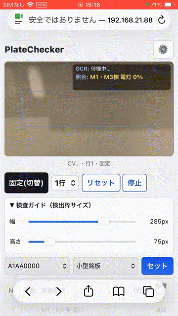

# PlateChecker — 出荷前銘板照合システム（試験バージョン）

**バージョン：v0.1.0 / 状態：動作部分の試験バージョン（工場実機で動作確認済み）/ 更新日：2026-06-26**

カメラ映像で銘板をリアルタイムにOCR・照合し、**PASS / NG** を自動判定する Web アプリです。
出荷前検査で、回答データ（製番ごとの正解）と銘板の記載内容を突き合わせ、行ごとに自動で消し込みます。

> このバージョンは「**動作部分の試験版**」です。検査の中核（映像検査・前処理・照合・枚数カウント）は
> 動作確認済みですが、一部に今後対応予定の項目があります（「今後の課題・既知の制限」を参照）。

## デモ



*カメラ映像で銘板を読み取り、回答データと照合して行を順不同で消し込み、PASS/NG を自動判定する様子。*

---

## 1. 概要

- **目的**：出荷前の銘板（製番・種類ごとに記載文言が決まっている）を、カメラ映像で読み取り、
  あらかじめ用意した回答データと照合して合否を自動判定する。
- **方式**：ブラウザ完結（サーバーへ画像送信しない）。OCR は Tesseract.js（`jpn+eng`）。
- **判定単位**：銘板1枚の各行が、回答の各行と一致すれば消し込み、全行そろえば「1枚OK」。同一銘板の
  必要枚数（`quantity`）に達したら次の銘板へ、全銘板完了で「全数検査完了」。

### 技術スタック

- フレームワーク：React + TypeScript + Vite
- OCR：[Tesseract.js](https://github.com/naptha/tesseract.js)（`jpn+eng`・永続ワーカー方式）
- カメラ：`navigator.mediaDevices.getUserMedia`（背面カメラ・高解像度を要求）
- 画像処理：[OpenCV.js](https://docs.opencv.org/)（輪郭検出・前処理の一部。CDN読込・任意）＋ canvas 処理
- スタイル：素の CSS（レスポンシブ・iPhone / iOS Safari 対応）

### 負荷分離（映像検査）

2つのループを独立に回し、OCR が重くても映像が固まらないようにしています。

- **表示・輪郭検出ループ**：約 **30FPS**（`requestAnimationFrame`）
- **OCR検査ループ**：約 **2FPS / 500msごと**（`setInterval`・多重実行防止つき）

更新タイミングが異なるため、画面上の枠・行帯と OCR 判定にはわずかなズレが出ます（仕様）。

---

## 2. 主な機能

- **映像リアルタイム検査**（30FPS表示／2FPS検査の負荷分離）。
- **検出枠（赤のガイド枠）の px 指定**：5px刻み・**最小100×50px**・**最大は映像枠の表示実寸に追従**
  （画面幅・回転で動的）。中心固定で対称に伸縮。**OpenCV による銘板輪郭検出**（緑枠）と、
  検出できない場合の**ガイド枠フォールバック**。
- **行検出**：**自動**（水平投影による行分割）／**固定**（行数セレクト 1〜4 を指定）。
- **順不同の行消し込み**：一致した行から確定し、全行確定で「1枚OK」。一度確定した行は再評価しない。
- **複数銘板の連続検査・残数カウントダウン**（`doneCount / quantity`）。
- **製番→種類の2段階選択**（回答データ `products[].types[].nameplates[]`）。
- **前処理パイプライン**：設定フォームの値で**全項目を実適用**。デフォルトは `threshold` 有効。
  **「デフォルト値に戻す」**ボタン、設定値はセッション中保持。
- **設定メニュー**（歯車・オーバーレイ）：映像を見ながら調整可能な下寄せ配置。
  **通常映像／前処理後映像の切替**（前処理後表示は実際のOCR入力と同じ範囲・同じ処理）。
- **映像右上のラベル表示**：`OCR:`（読み取り生テキスト）と `照合:`（対象＋類似度）の2段。
- **ホワイトリスト**：`whitelist.jsonc`（コメント可・ビルド時取り込み・**ファイルのみ編集**）。
- **OCR**（`jpn+eng`）／**正規化**（全角→半角・空白除去・置換辞書）／**結果JSON出力**（退避）／
  **手動検査**（画像アップロード・撮影／退避）。

---

## 3. セットアップ・起動

前提：Node.js 18 以上（推奨 20 以上）。

```bash
npm install      # 依存インストール
npm run dev      # HTTPS開発サーバー起動（https://localhost:5173 を自動で開く）
npm run build    # 型チェック + 本番ビルド（dist/ に出力）
npm run preview  # ビルド成果物のローカル確認
npm run typecheck# 型チェックのみ
```

> **HTTPS で起動します。** カメラ API（getUserMedia）は HTTPS（または localhost）でしか動作しないため、
> `@vitejs/plugin-basic-ssl` の自己署名証明書つき HTTPS で起動します。証明書の警告は「詳細設定 →
> このまま続行」で進んでください（`localhost` は HTTPS 扱いでカメラ可）。

### iPhone（実機）での使い方

1. PC で `npm run dev -- --host` を実行し、LAN へ公開する。
2. iPhone を**同じ Wi-Fi** に接続し、Safari で **`https://<PCのIP>:5173`** を開く。
3. 自己署名証明書の警告は「詳細を表示 → このWebサイトにアクセスS（続行）」で許可する。
4. カメラ使用の許可を求められたら許可する。
5. つながらない場合は、PC のファイアウォールが 5173 番ポートを許可しているか、同一 Wi-Fi かを確認する。

---

## 4. 使い方（検査フロー）

1. **製番を選ぶ** → その製番にぶら下がる**種類**を選び、**「セット」**。セットした種類の全銘板(No)が
   検査内容テーブルに表示され、各 No の**検査数**が `0/quantity` で初期化されます。
2. **「検査開始」**でカメラを起動（初回は Tesseract 言語データと OpenCV.js の取得に時間がかかります）。
3. 銘板を中央の**検出枠**に収める。輪郭が取れれば緑枠の領域、取れなければガイド枠（赤）が OCR 領域です。
   検出枠サイズは「検査ガイド」を開いて **px** で調整できます。
4. **行検出モード**（自動／固定）を切替。固定時は**行数セレクト（1〜4）**で行数を指定。
5. 検査は自動で回り続け、**一致した行から順不同で消し込み**ます（OK列に ○）。
6. **全行が消し込まれると「1枚OK」**として、その No の**検査数がカウント**（例 `1/3`）。必要枚数に達すると
   次の No へ自動で進みます。
7. **すべての No が必要枚数に達すると「全数検査完了」**がステータスに表示されます。
8. 「結果出力・手動検査」（退避メニュー）から**検査結果JSONのダウンロード**や**手動検査**が行えます。

> **OKが出続けない行は確定されません**（誤検出による誤OK防止）。確定しない行は目視検査へ回す運用です。

---

## 5. 画面構成（上から順・iPhone 1画面想定）

1. **ヘッダー**：タイトル＋右端に**設定（歯車 ⚙）アイコン**（設定メニューを開く）。
2. **映像枠（横長 16:9）＋検出枠**：ガイド枠は赤、検出輪郭は緑、行帯は水色。**記載内容・判定は映像に
   重ねません**。右上に `OCR:` / `照合:` の2段（固定高さ）。
3. **最小ステータス（1行）**：`CV✓・行3・自動` のように集約。OCR言語データ読込失敗時はその旨を表示。
4. **操作行（横並び1行）**：`[モード切替(自動/固定)] [行数セレクト] [検査開始/停止・リセット]`。
   折り返さず、自動↔固定の切替で揺れません。
5. **検査ガイド（折りたたみ）**：検出枠の「幅」「高さ」px スライダー。
6. **検査データ**：製番→種類の2段階選択＋「セット」。
7. **検査内容テーブル（固定高さ＋スクロール）**：`No / 行数 / 記載内容 / OCR / 検査数`。
8. **結果出力・手動検査（折りたたみ・退避）**：結果JSONダウンロード／画像アップロード・撮影OCR。

> 縦の高さは固定（テーブルはスクロール、行数セレクトは非表示時も領域確保、映像枠は `aspect-ratio`、
> 右上表示は固定高さ）で、**操作で画面が揺れない**設計です。

---

## 6. 設定メニュー（歯車 ⚙ ／ オーバーレイ）

歯車から開きます。**画面下寄せのボトムシート**で背景を暗くせず、**映像枠に被らない**ため、
**映像（前処理後表示）を見ながら**値を調整できます。項目が多い場合は**メニュー内をスクロール**（見出しは
上部固定）。オーバーレイのため本体レイアウトは揺れません。

### 通常映像／前処理後映像の切替（Switch）

- **OFF（既定）＝通常映像**。
- **ON＝前処理後映像**：OCR が実際に処理しているのと**同じ切り出し領域だけ**に、**同じ前処理パイプライン**を
  かけた結果を表示（領域外は通常映像が透過）。「OCRがどの範囲を・どんな見た目で食べているか」が分かる
  デバッグビューです。表示は約10FPSに間引き・領域を縮小して処理しますが、**OCR入力には波及しません**。

### 前処理設定フォーム（値を実際の前処理に適用）

- フォームの値は **OCR に渡る画像の前処理に実際に適用**されます（全項目）。変更は **OCR入力と
  「前処理後映像」表示の両方**へ即時反映（同一パイプライン）。
- **OCR の切り出し範囲・座標・アスペクト比は変えません。** 変わるのは「切り出した画像にかける前処理」だけ。
- 各項目は個別UI（数値／トグル／セレクト）。**ラベル・選択値は日本語表示**、**内部キー・型は英語**。
- **最下段の「デフォルト値に戻す」**で全項目を既定値へリセット。設定値は**メニューを閉じても保持**
  （セッション中。リロード永続化は対象外）。

**適用順序（パイプライン）**：グレースケール → `denoise` → `bilateral` → `clahe` → `local_contrast` →
`hist_equalize` → `gamma` → `sharpen` → `unsharp` → `morph` → `stroke_boost` → `threshold`（以上は領域
レベル・幾何不変）→ 行ごとに `deskew` → `crop_margin` → `resize`（`keep_ratio`：縦横比を歪めない）。
`ratio_threshold` は行の縦横比で `resize` 高さを `single`/`wide_height` に切替える分岐に使用。
`clahe`・`bilateral`・`morph` 等は OpenCV.js を利用し、**未ロード/失敗時は素のグレースケール＋JS可能分へ
フォールバック**します。**行検出は前処理設定に左右されない安定グレースケール上**で行うため、前処理を変えても
行分割は壊れません。

**前処理パラメータと既定値**（`src/logic/preprocessSettings.ts` / `types.ts` の `PreprocessSettings`）：

| 項目 | 既定値 | 概要 |
| --- | --- | --- |
| `ratio_threshold` | `1.6` | resize 高さの単一行/横長 切替えしきい値（縦横比） |
| `threshold` | `binary` / `70`（**有効**） | 二値化（種別・しきい値）。影/反射で潰れる場合は「なし」に |
| `clahe` | `clip_limit 1` / `tile 2` | 適応ヒストグラム平坦化（常時） |
| `sharpen` | 有効 / `amount 0.2` / `sigma 0.5` | シャープ（アンシャープマスク） |
| `gamma` | 無効 / `1` | ガンマ補正 |
| `morph` | 無効 / `close` / `ksize 3` / `iter 1` | モルフォロジー |
| `unsharp` | 無効 / `amount 0.8` / `radius 1` / `threshold 0` | アンシャープ |
| `bilateral` | 無効 / `d 5` / `sigma 50/50` | エッジ保持平滑化 |
| `local_contrast` | 無効 / `clip 2` / `tile 8` | 局所コントラスト（CLAHE） |
| `crop_margin` | 無効 / `threshold 245` / `margin 2` | 余白クロップ（行単位） |
| `hist_equalize` | 無効 | ヒストグラム平坦化 |
| `stroke_boost` | 無効 / `close` / `ksize 1` / `iter 1` | 線強調 |
| `denoise` | `gaussian` / `ksize 1` | ノイズ除去 |
| `deskew` | 無効 | 傾き補正（行単位） |
| `resize` | `single 48` / `wide_height 48` / `keep_ratio true` | 行高さ正規化（縦横比保持） |

---

## 7. 検出枠（px）と行検出モード

- **検出枠サイズは px 指定**：5px刻み・**最小は幅100px×高さ50px**・**最大は映像枠の表示実寸に追従**。
  指定 px は**映像枠上で見えている実寸**を基準とし、OCR切り出し用の実映像解像度との換算は内部で吸収します
  （指定px＝映像枠で見える範囲）。表示は CSS `object-fit:cover` に合わせ、オーバーレイ・前処理後映像・
  通常映像・OCR入力の**範囲とアスペクト比が一致**します（縦横比を歪めない）。

| モード | 行の決め方 | 向いている場面 |
| --- | --- | --- |
| **自動** | グレースケールの水平投影（暗い画素の塊）から行を自動分割 | 行間が空いていて分離しやすい銘板 |
| **固定** | 領域の縦を指定行数で等分し各帯を1行として扱う | 行が詰まる／自動でうまく割れない銘板 |

---

## 8. ホワイトリスト（`whitelist.jsonc`）

認識を許可する文字（`tessedit_char_whitelist`）は、**プロジェクトルートの `whitelist.jsonc`** が
**唯一の編集元**です（画面UIからは編集しません）。`src/logic/whitelist.ts` が **ビルド時に `?raw` で取り込み**
（実行時 fetch ではない）、コメント除去 → グループ連結 → **重複文字を1つに統合**して、`ocrService.ts` の
`DEFAULT_OCR_OPTIONS.whitelist` に供給します。

- **構造**：`groups` に**文字種ごと**（`base` / `hiragana` / `katakana` / `kanji` / `symbols`）の文字列を持ち、
  各グループに `//` コメントを付けています。全グループを連結し重複を除いた1つの文字列が最終ホワイトリストです。
- **編集方法**：該当グループの文字列を編集（またはグループ追加）。同じ文字が複数グループにあっても自動で
  1つに統合（出現順は保持）。**空にすると無制限**。**変更後は再ビルド／ホットリロードで反映**。
- **バックアップ**：文字追加前の現行内容を **`whitelist.backup.jsonc`**（参照用）に保存。アプリが読むのは
  `whitelist.jsonc` のみです。
- 適用は**映像検査・手動検査の両経路**。永続ワーカー対策として**ワーカー生成直後＋各認識直前の二重適用**で
  確実に効かせます。

> **方針メモ**：ひらがな・カタカナ・漢字・記号を業界実績ベースで広く登録しています。許可文字が増える分
> 「絞り込み」効果は弱まりますが、未登録文字による取りこぼし（読めない）を減らす狙いです。

---

## 9. OCR・正規化・照合

- **OCR**：`jpn+eng`（`src/services/ocrService.ts` の `DEFAULT_OCR_OPTIONS`）。永続ワーカーで行ごとに高頻度
  認識。言語データは既定で jsDelivr CDN から取得（`OCR_LANG_PATH` で差し替え可）。初回はダウンロードに
  時間がかかり、以降は IndexedDB にキャッシュ。読込失敗時はステータスに表示。
- **正規化**（`src/logic/normalize.ts`）：全角→半角、**全空白の除去**、比較に不要な記号の除去、
  **置換辞書 `REPLACEMENT_DICTIONARY`**（例 `髙→高`、`﨑→崎`）で誤読・異体字を補正。
- **照合**（`src/logic/match.ts`）：期待値ごとに OCR 候補から最も近い行を選び、レーベンシュタイン距離ベースの
  類似度で判定。**完全一致(=1.0)で PASS**、`reviewThreshold`（既定 0.8）以上で REVIEW、未満は NG。
  映像検査は **PASS（完全一致）でのみ行を確定**します。

---

## 10. データ構造

### 回答データ（`public/sample-answers.json`）

製番(`serialNumber`) に複数の種類(`types[]`)、各種類に複数の銘板(`nameplates[]`)、各銘板が行リスト
(`labelTexts`) と枚数(`quantity`) を持つ入れ子構造です。

```json
{
  "products": [
    {
      "serialNumber": "A1AA0000",
      "types": [
        {
          "type": "小型銘板",
          "nameplates": [
            { "labelTexts": ["M1・M3棟 電灯"], "quantity": 2 },
            { "labelTexts": ["M1・M3棟 電灯", "VCB(52F1)"], "quantity": 2 }
          ]
        }
      ]
    }
  ]
}
```

- `labelTexts`：その銘板の行ごとの期待値（各要素が1行）。
- `quantity`：同一銘板の枚数（必要枚数）。

### 検査結果JSON（出力）

製番単位（各 No の判定・必要枚数・行ごと照合）／手動検査（1銘板分）の結果を JSON で
ダウンロードできます（`src/logic/resultOutput.ts`）。

---

## 11. プロジェクト構成

```
whitelist.jsonc            OCRホワイトリストの編集元（文字種グループ＋コメント・ビルド時取り込み）
whitelist.backup.jsonc     ホワイトリストのバックアップ（参照用・文字追加前のスナップショット）
public/
  sample-answers.json      回答データ（製番→種類→銘板/枚数）
src/
  types.ts                 共通型（Product/Nameplate・進捗・PreprocessSettings 等）
  services/
    ocrService.ts          OCR（OcrService 抽象化／Tesseract・永続ワーカー・言語データ読込）
    cameraService.ts       カメラ（起動/停止/フレームキャプチャ・高解像度要求）
    opencvService.ts       OpenCV.js 読込＋銘板輪郭検出（任意・失敗時フォールバック）
    answerDataService.ts   回答データ読込（products→types→nameplates）
  hooks/
    useVideoInspection.ts  映像検査（30FPS表示＋2FPS検査・検出枠px・行消し込み・枚数カウント）
    useCamera.ts           手動検査用カメラの React 連携
  logic/
    vision.ts              行分割（安定グレースケール・水平投影/固定分割）
    preprocessPipeline.ts  OCR前処理パイプライン（設定値で実適用・OpenCV/JSフォールバック）
    whitelist.ts           whitelist.jsonc を取り込み・コメント除去・連結・重複除去
    preprocessSettings.ts  前処理設定のデフォルト値（PreprocessSettings）
    normalize.ts           正規化（全角→半角・空白除去・記号除去・置換辞書）
    match.ts               照合（レーベンシュタイン・段階判定・行ごと照合）
    resultOutput.ts        結果JSON生成・ダウンロード
  components/
    PreprocessSettingsForm.tsx  前処理設定フォーム（設定オーバーレイ内・日本語表示）
  App.tsx                  画面（映像枠/操作行/検査ガイド/製番→種類/テーブル/設定/退避メニュー）
  main.tsx                 エントリポイント
```

---

## 12. 今後の課題・既知の制限

試験バージョンとして「どこまでが完成で、何が残っているか」を明記します。

### 今後の課題（後回しと決めた積み残し）

- **検査→合格後の動作**：合格後のフロー（次工程への遷移・記録・リセット運用など）は**修正予定**。
  まずは検査精度を優先したため後回しにしています。
- **記号の置き換え（誤取り違え）対応**：OCR の記号取り違えは、置換辞書（`src/logic/normalize.ts` の
  `REPLACEMENT_DICTIONARY`）に項目を追加して補正していく余地があります（実運用で出た誤読を順次登録）。
- **外注先利用に向けて（将来）**：現状は**社内LAN＋自己署名HTTPS**の試験運用です。社外利用時は、
  ホスティング（正式な証明書）＋アクセス制限（認証・IP制限等）への移行が必要です。

### 既知の制限

- **OCR精度の特性**：ホワイトリストを実績ベースで広く持つため**取りこぼしは減りますが、似た文字への
  誤認識**が出る場合があります。前処理（`threshold` 等）は**銘板・照明条件により調整が必要**です
  （潰れる場合は設定で `threshold` を「なし」にする等）。
- **映像と判定のズレ**：30FPS表示と2FPS検査は独立のため、枠・行帯と OCR 判定の更新タイミングに
  わずかなズレがあります（仕様）。
- **行の確定条件**：行は**完全一致でのみ確定**（誤OK防止）。確定しない行は目視検査へ回す前提です。
- **手動検査の前処理**：手動検査（アップロード/撮影）は画像をそのまま OCR に渡し、映像検査の前処理
  パイプラインは通りません。
- **初回ロード**：Tesseract 言語データ・OpenCV.js は初回 CDN 取得のためネットワークが必要です
  （以降キャッシュ）。

---

## 13. バージョン・状態

- **バージョン**：`v0.1.0`（`package.json` と一致）
- **状態**：**動作部分の試験バージョン**（工場での実機確認で動作確認済み）
- **更新日**：2026-06-26
- Git タグ：`v0.1.0`（タグの push はユーザーが実行）
